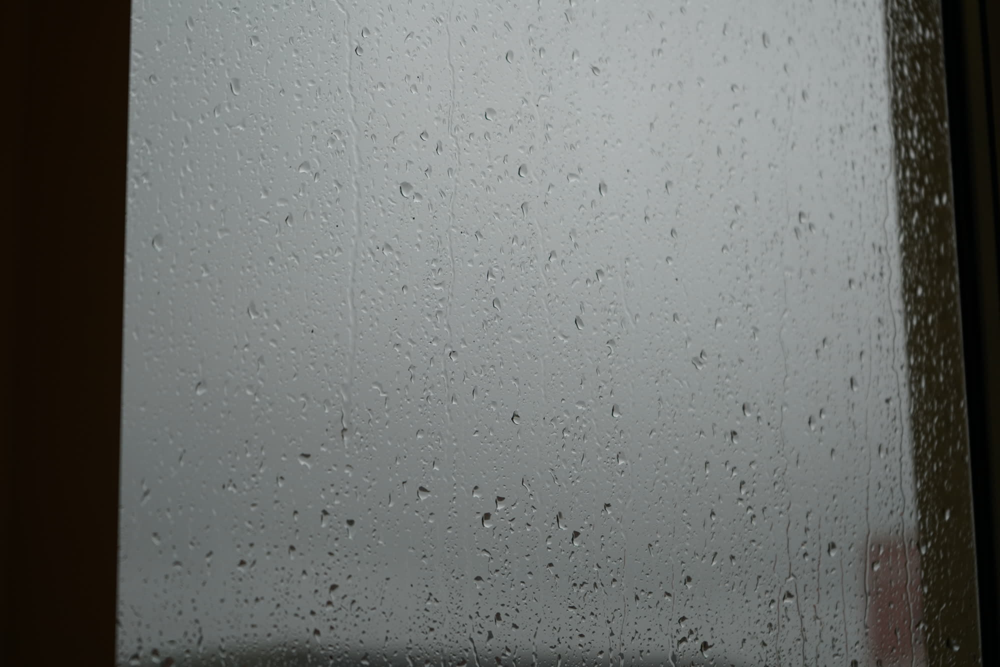
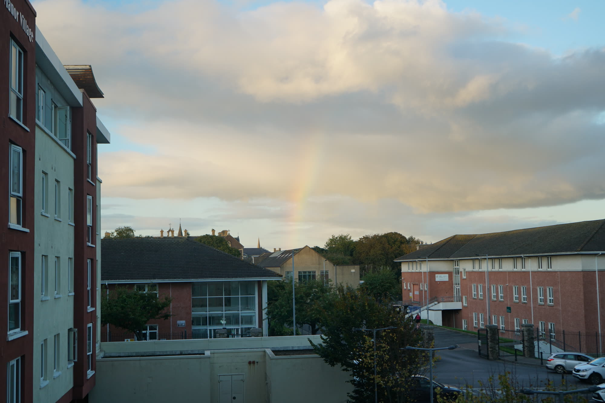
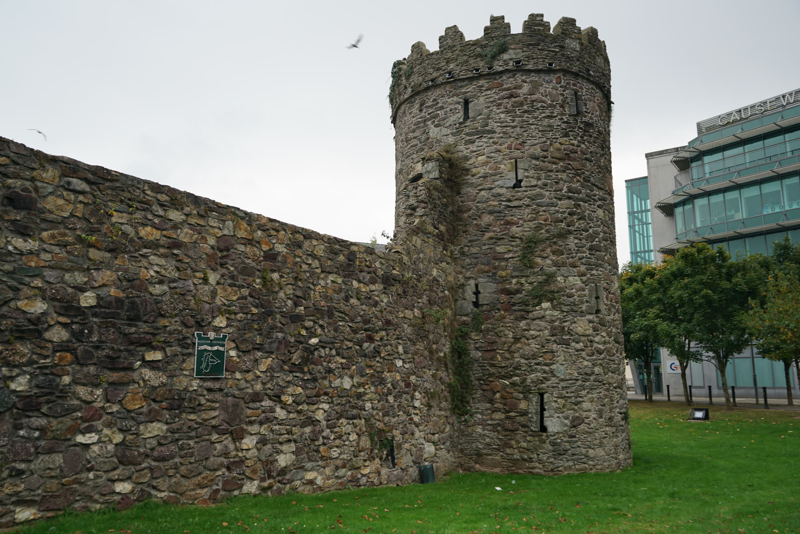
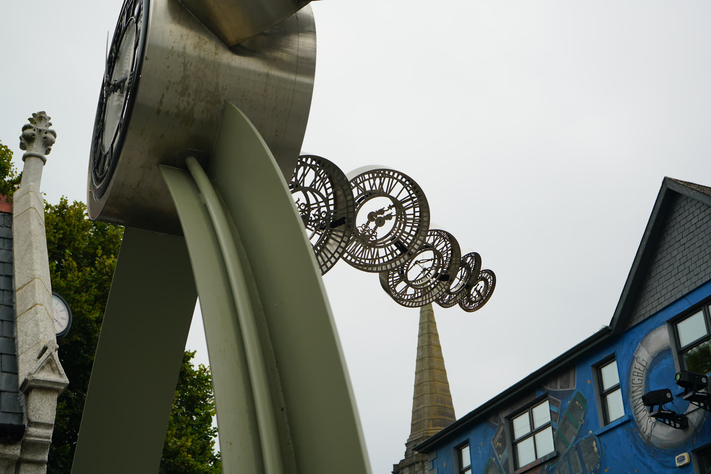
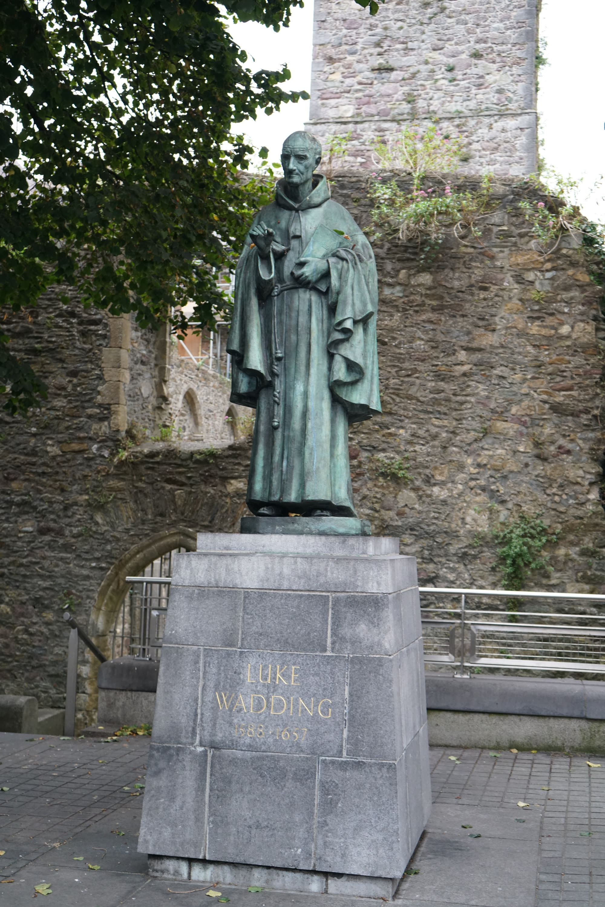

# Misc

## Ame (雨)
<!-- more -->

### 雨の日は 雨を楽しむ baka_mashiro かな

* translation: On rainy days, who enjoys the rain, baka_mashiro, I wonder? *

## Rainbow

## Legacy

## Toki (時)

### 固体状態での時間

## Statue
