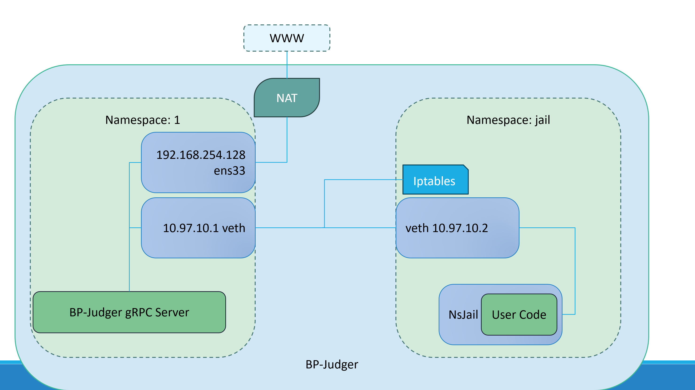

# BP-Judger 网络配置



## Motivation

由于`gRPC`需要通过网络来发起调用

**BP-Judger**( 后简称 **BP**) 与 **nsjail**(后简称 **jail** ) 中的**用户程序**(后简称 **bot** ) 需要使用网络通信，但是不能使bot访问除了`BP-Judger gRPC Server`之外的所有网络资源，于是需要这样的网络配置。

## What

使用Linux中的`netns`进行网络命名空间(Net namespace)的隔离

使用`veth pair`连通 bot 所在的命名空间 **jail_ns** 与 BP 所在的命名空间（可以是别的命名空间或者主要网络）

## How

::: tip
建议您使用这个Perl脚本快速部署网络 

[link](https://codeberg.org/adrian-blx/setup-ns/src/branch/master/setup-ns.pl)

然后直接跳至配置iptables规则
:::

::: danger
以下内容未经验证，可能存在错误！
:::


Hint: You may need `sudo` to execute the following commands.

```bash {22}
#!/bin/bash
# 创建 jail_ns 命名空间
ip netns add jail_ns
# 创建 veth pair (veth pair总是成对出现)
ip link add veth-jail type veth peer name veth-host

# 运行ip a你可以查看创建的 veth pair
# ip a
# 如果正确，你会看见两个veth设备

# 将 veth pair 的一端(veth-jail)放入 jail_ns 命名空间
ip link set veth-jail netns jail_ns
# 为两个 veth 接口配置 IP (可以自行更改)
ip netns exec jail_ns ip addr add 10.0.0.1/24 dev veth-jail
ip addr add 10.0.0.2/24 dev veth-host
# 启用两个 veth 接口
ip netns exec jail_ns ip link set veth-jail up
ip link set veth-host up

# 在 host net namespace 设置  ens33 为 veth-host 通过 NAT 转发数据包 （可选的，bp-judger不需要这个）
# (从外部看，veth-host 出站的数据包就像是从 ens33 出站的数据包)
# !!请把 ens33 换成你的对应环境里面的设备
# iptables -A FORWARD -i veth-host -o ens33 -j ACCEPT
# iptables -A FORWARD -i ens33 -o veth-host -j ACCEPT
# iptables -t nat -A POSTROUTING -s 10.0.0.0/24 -o ens33 -j MASQUERADE
# 注意：上面三个设置iptables是可选的

# @@@ 设置 jail_ns 的 iptables，只放行对特定端口的连接 @@@
# 进入 jail_ns 
ip netns exec jail /bin/bash
# 设置 OUTPUT chain 的默认行为为 DROP
iptables -P OUTPUT DROP
# 设置只允许对特定模板特定端口的连接
# 这里的目标是10.0.0.1, 即 veth-host，且流量通过 NAT 转发到 ens33 (即 host)
iptables -A INPUT -p tcp -d 10.0.0.1 --dport 3000 -j ACCEPT
# 如果需要更多请重复上一步

# 查看 iptables
iptables -L --line-numbers
# 如果一切正常，你应该看到
: '
    Chain INPUT (policy ACCEPT)
    num  target     prot opt source               destination         

    Chain FORWARD (policy ACCEPT)
    num  target     prot opt source               destination         

    Chain OUTPUT (policy DROP)
    num  target     prot opt source               destination         
    1    ACCEPT     tcp  --  anywhere             10.0.0.2             tcp dpt:3000
'

```

### Test it out

```bash
# 在 veth-host 启动测试服务
echo "Hello from veth-host" | nc -l -p 3000
```

打开另一个终端

```shell
# 在 veth-jail 环境内测试
# 进入 veth-jail 命名空间
ip netns exec veth-jail /bin/bash

# 在 veth-jail 中的 Shell 中，尝试连接到 veth-host 上的 Echo 服务器
echo "Hello from veth-jail" | nc veth-host-ip 3000
```

如果一切正常，你会在两边分别看到 Hello from veth-jail 与 Hello from veth-host

::: tip
这里假设了你的防火墙没有设置任何规则.
:::


也许可能会用到（在这里并没有）：

```shell
# 在宿主(host) net namespace 临时启用 ip_forward
### 注意 ###
# 临时启用：下次重启系统时，并不会保留这个设置
# echo 1 > /proc/sys/net/ipv4/ip_forward
```

如果设置有困难，用`tcpdump`检查

```shell
# tcpdump -i <iface_name>
```

