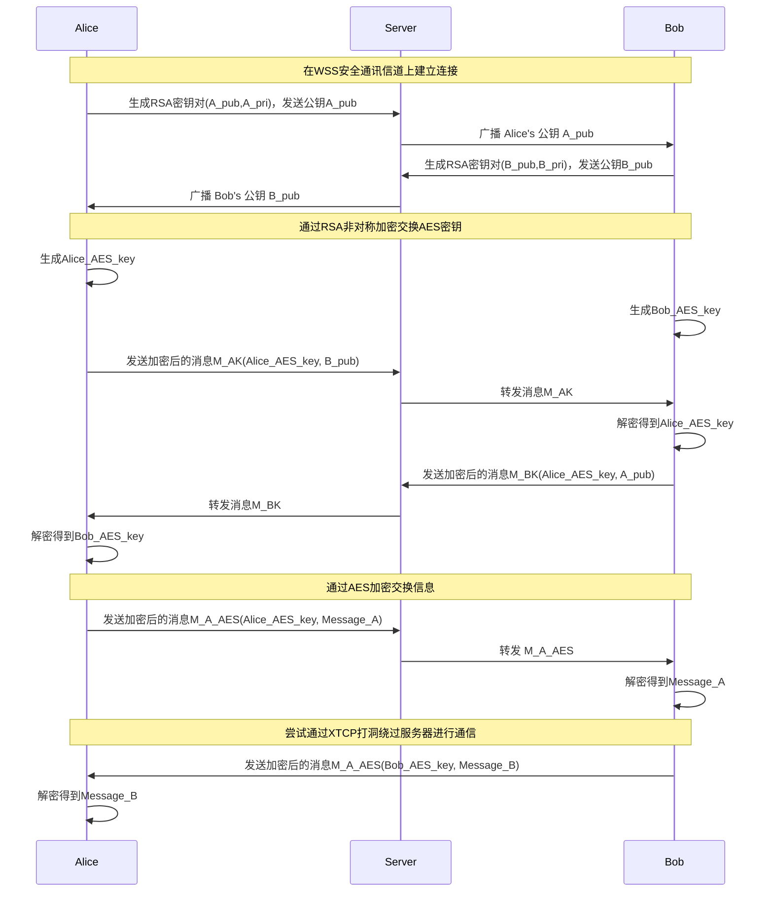

# E2EE Message

```mermaid
sequenceDiagram
    participant Alice as Alice
    participant Server as Server
    participant Bob as Bob
    
 	Note over Alice, Bob: 在WSS安全通讯信道上建立连接
    Alice->>Server: 生成RSA密钥对(A_pub,A_pri)，发送公钥A_pub
    Server->>Bob: 广播 Alice's 公钥 A_pub
    Bob->>Server: 生成RSA密钥对(B_pub,B_pri)，发送公钥B_pub
    Server->>Alice: 广播 Bob's 公钥 B_pub
    Note over Alice, Bob: 通过RSA非对称加密交换AES密钥

	Alice->>Alice: 生成Alice_AES_key
	Bob->>Bob: 生成Bob_AES_key

    Alice->>Server: 发送加密后的消息M_AK(Alice_AES_key, B_pub)
    Server->>Bob: 转发消息M_AK
    Bob->>Bob: 解密得到Alice_AES_key
    
    Bob->>Server: 发送加密后的消息M_BK(Alice_AES_key, A_pub)
	Server->>Alice: 转发消息M_BK
	Alice->>Alice: 解密得到Bob_AES_key
	
	Note over Alice, Bob: 通过AES加密交换信息
	
	Alice->>Server: 发送加密后的消息M_A_AES(Alice_AES_key, Message_A)
    Server->>Bob: 转发 M_A_AES
    Bob->>Bob: 解密得到Message_A
    
    Note over Alice, Bob: 尝试通过XTCP打洞绕过服务器进行通信
    Bob->>Alice: 发送加密后的消息M_A_AES(Bob_AES_key, Message_B)
    Alice->>Alice: 解密得到Message_B


```

Note that, direct link is based on NAT Traversal. If failed, fall back to server-forwarded transmission.
