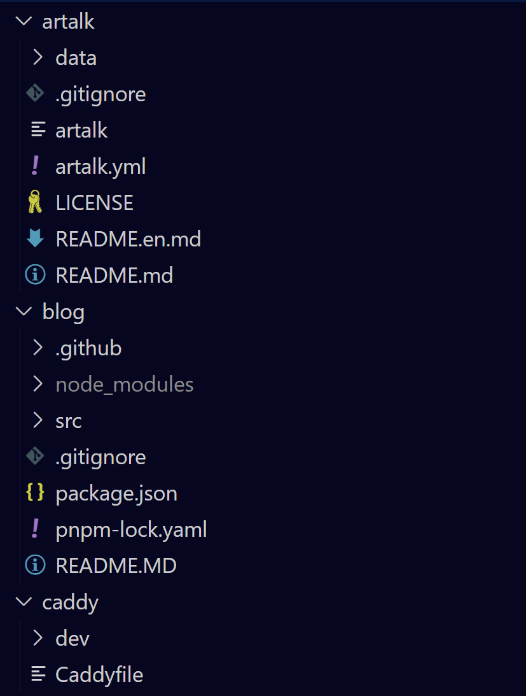

# How to run 小龙系统
<!-- more -->
::: danger
文档正在快速变化，stay tuned! 
:::

## 运行龙博客

你需要克隆的repo:

1. https://github.com/xuxl-dev/artalk
2. https://github.com/xuxl-dev/blog
3. https://github.com/xuxl-dev/caddy

`artalk`是评论的后端，`blog`是本体，`caddy`是反代工具。这里假设您已经完成了克隆，并且放在同个文件夹下，如图所示：



### 开发

1. 启动artalk

   ```bash
   cd artalk
   ./artalk
   ```

2. 启动blog

   ```bash
   cd blog
   pnpm i # 安装依赖 如果没有安装pnpm，请先安装
   pnpm dev
   ```

3. 启动caddy

   ```bash
   cd caddy/dev
   caddy start # 当然，请先安装caddy
   ```

4. 访问 `localhost`

::: tip
localhost是由评论区的，如果是直接用pnpm dev开放的带端口的进去，评论区不能正确加载，因为需要反向代理。
:::

### 部署

[TODO]